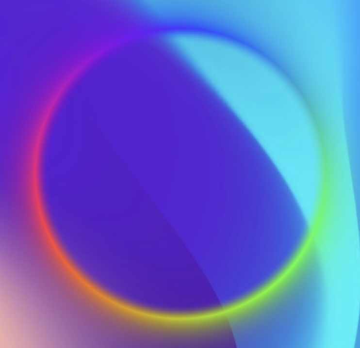

# Shader integration in Compose Multiplatform Demo targeting Android, iOS, Web, Desktop (JVM).

The shader runner is platform specific: one for Android the other is for all the other platforms
using Skiko (Skia for Kotlin) as graphic engine. The shader language is SkSL - Skia Shading Language,
allowing to write one shader for all platforms.

### Build and Run

As usual from Android Studio.
